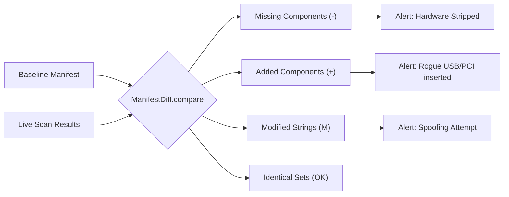

# Sentinel Architecture

Sentinel utilizes a unified core domain model mapped strictly to generic OS traits. Below is a high-level representation of the module topography.

## Security & Privacy Considerations

Manifest collections identify the hardware definitively. For environments sharing security telemetry, privacy tokens (like `SHA256`) should wrap specific serial strings before transmitting payloads containing `HardwareManifest` models.

## Detailed Diff Engine

At the core of tampered environment detection sits the `ManifestDiff` module:

