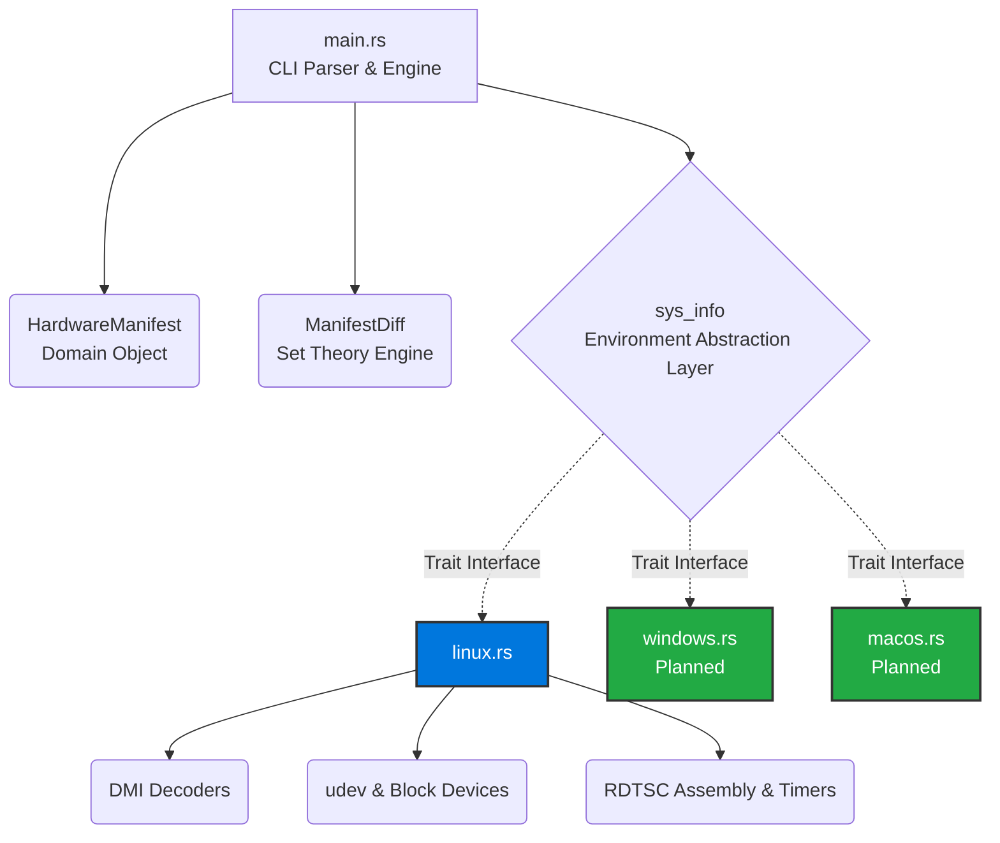

# Sentinel Architecture

Sentinel utilizes a unified core domain model mapped strictly to generic OS traits. Below is a high-level representation of the module topography.



## Security & Privacy Considerations

Manifest collections identify the hardware definitively. For environments sharing security telemetry, privacy tokens (like `SHA256`) should wrap specific serial strings before transmitting payloads containing `HardwareManifest` models.

## Detailed Diff Engine

At the core of tampered environment detection sits the `ManifestDiff` module:

```mermaid
flowchart LR
    A[Baseline Manifest] --> C{ManifestDiff.compare}
    B[Live Scan Results] --> C

    C --> D[Missing Components (-)]
    C --> E[Added Components (+)]
    C --> F[Modified Strings (M)]
    C --> G[Identical Sets (OK)]

    D --> H[Alert: Hardware Stripped]
    E --> I[Alert: Rogue USB/PCI inserted]
    F --> J[Alert: Spoofing Attempt]
```
