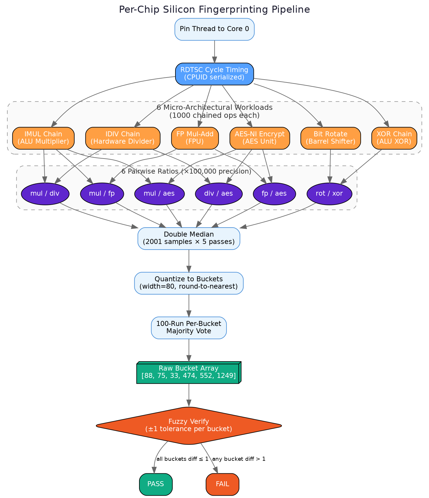

# Per-Chip Silicon Fingerprinting

Sentinel relies on Deep Silicon Fingerprinting using the system's `RDTSC` (Read Time-Stamp Counter) on x86 architectures to extract unique micro-architectural timing characteristics.

## The Theory

On standard operating systems, distinguishing between two exact identical CPUs (e.g. two physical Intel Core i9-14900Ks) is fundamentally impossible through standard software APIs like CPuID or model string comparisons. The silicon manufacturers deliberately deprecated generic hardware serial numbers on consumer silicon two decades ago.

However, no two physical chips come out of the semiconductor fab exactly identical. Due to **process variation** inside the silicon wafers, the physical timing limits of independent execution units fluctuate slightly per chip.

## Mechanism

Sentinel measures these tiny execution time discrepancies by chaining thousands of dependent instructions and timing them down to the cycle:

### Ratios Cancel Frequency Interference

Why ratios? Modern platforms continuously adjust CPU clock frequencies (idle vs boost). By timing multiple execution units synchronously and comparing their relative performance ratios, Sentinel calculates values that **persist stably** across extreme frequency throttling.

### The 100-Run Majority Vote Filter

Because multitasking OSes (Windows, macOS, Linux) constantly interrupt threads for system scheduling, raw timing metrics are occasionally disrupted.

Sentinel prevents this using a 100-run voting system:

1. **Thread Affinitization:** Pin the measuring thread strictly to physical Core 0 to prevent P-core/E-core migration or cache-invalidation mid-measurement.
2. Fire 100 consecutive measurement sweeps
3. Inside each sweep, collect thousands of iterations and resolve the median
4. Quantize the ratios into coarse logical bins (buckets) to absorb ±5% temperature jitter
5. Select the final signature that appears most frequently (mode) across the 100 runs

The final 64-bit signature hashes the deterministic CPU model string and the stable timing ratio buckets to generate a persistent **per-chip unique hardware token**.
