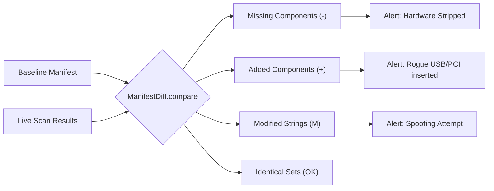

# Detailed Diff Engine

At the core of tampered environment detection sits the `ManifestDiff` module. Instead of simply performing a binary YES/NO hash check, Sentinel's Verification Engine computes precise Set Theory differences across every hardware vector.

## How It Works

1. **Extraction:** Sentinel parses the persisted Baseline JSON configuration.
2. **Re-Scan:** It queries the live host environment mapping hardware components into memory.
3. **Comparison:** It diffs collections of drives, RAM DIMMs, MAC arrays, and GPU arrays tracking exactly what was inserted (rogue PCI devices) or removed (stripped RAM). CPU identity fields are compared exactly, while CPU timing signature buckets use ±1 fuzzy tolerance.
4. **Resolution:** Emits a granular incident report to stdout before cleanly exiting with status `1` upon tamper detection.
